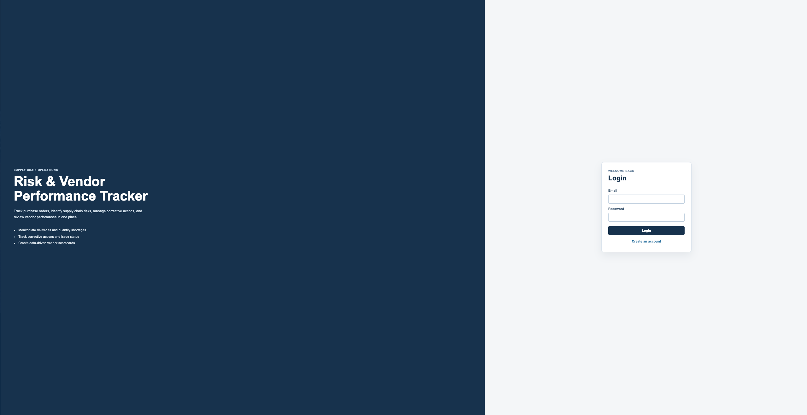
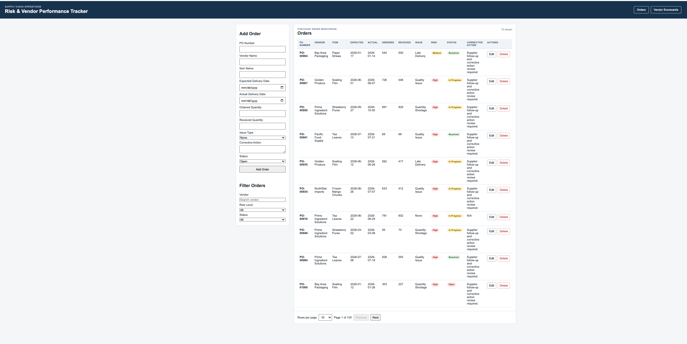

# Supply Chain Risk and Vendor Performance Tracker

## Author
Han Huang

## Course

**Course:** CS5610 Web Development  
**Class link**
https://johnguerra.co/classes/webDevelopment_online_summer_2026/

## Live Website

[Open the deployed application](https://supply-chain-risk-backend.onrender.com)

## Project Description

The Supply Chain Risk and Vendor Performance Tracker is a full-stack web application for recording purchase order information, tracking supply chain risks, and reviewing vendor performance.

Users can record purchase order information and track late deliveries, quantity shortages, quality issues, corrective actions, and unresolved order problems. They can also create vendor scorecards using delivery, quality, communication, responsiveness, and cost scores.

---

## Features

### User Authentication
- Register a new account
- Log in and log out securely
- Session-based authentication using Passport.js

### Order Risk Tracking
- Create purchase orders
- Update existing orders
- Delete order records
- Filter orders by vendor, risk level, and status
- Automatically calculate order risk levels
- View paginated order records

### Vendor Performance Scorecards
- Create vendor scorecards
- Update scorecards
- Delete scorecards
- Filter scorecards by vendor or performance rating
- Automatically calculate overall scores after input rating each part rating
- Automatically assign performance ratings
- View paginated scorecard records

---

## User Personas

### Cindy - A Supply Chain Planner

Cindy manages purchase orders from multiple vendors and products. She needs a one place to monitor order issues, corrective actions, and action status.

### Hedy - A Sourcing Manager

Hedy evaluates supplier performance. She wants to compare vendors using delivery, quality, communication, responsiveness, and cost scores to identify suppliers that may require improvement.

---

## User Stories

### Order Risk Tracking

As a supply chain planner, I want to record, review, update, delete, and filter purchase order delivery information. That will help me understand what happened and identify unresolved risks quickly, and help vendor to improve their servers.

### Vendor Performance Scorecards

As a sourcing manager, I want to create, review, update, delete, and filter vendor scorecards so that I can evaluate supplier performance and identify vendors that may need corrective action.

### Authentication

As a user, I want to register, log in, stay logged in during my session, and log out securely so that only authorized users can access the application.

---

## Application Pages

### Login and Registration

- Register a new account
- Log in
- Log out
- Maintain login sessions

### Orders

Users can:

- Record purchase order information
- Update and delete order records
- Filter orders by vendor, risk level, and status
- Review automatically calculated risk levels
- Browse orders with pagination

### Vendor Scorecards

Users can:

- Create vendor scorecards
- Update and delete scorecards
- Enter delivery, quality, communication, responsiveness, and cost scores
- Review automatically calculated overall scores
- Review automatically generated performance ratings
- Browse scorecards with pagination

---

## Screenshots

### Login Page



### Orders Page



### Vendor Scorecards


---

## Technology Stack

### Frontend

- React
- JavaScript (ES6)
- HTML5
- CSS3
- Fetch API

### Backend

- Node.js
- Express

### Database

- MongoDB Atlas
- MongoDB Node.js Driver

### Authentication

- Passport Local Authentication
- Express Session

### Development Tools

- Git
- GitHub
- Vite

---

## Project Structure

### Backend

- `backend/server.js` — Starts the Express server and serves the React application.
- `backend/auth/passportConfig.js` — Configures Passport Local authentication.
- `backend/db/mongoConnection.js` — Connects to MongoDB Atlas.
- `backend/routes/auth.js` — Authentication APIs.
- `backend/routes/orders.js` — Order management APIs.
- `backend/routes/scorecards.js` — Vendor scorecard APIs.
- `backend/scripts/seedDatabase.js` — Seeds sample data into MongoDB.

### Frontend

- `frontend/src/App.jsx` — Main React application.
- `frontend/src/components/` — Reusable React components.
- `frontend/src/services/` — API request functions.
- `frontend/src/utils/` — Utility functions for calculations.
- `frontend/src/assets/` — Static assets used by the frontend.

### Design

- `design/design.md` — Project design document.
- `design/P3-mockup.png` — mockup screenshot.
- `design/login-page.png` — Login page screenshot.
- `design/orders-page.png` — Orders page screenshot.
- `design/scorecard-page.png` — Vendor scorecards page screenshot.


---

## Installation

Clone the repository:

```bash
git clone https://github.com/HedyHHuang/supply-chain-risk-and-vendor-performance-tracker.git
```

Install frontend dependencies:

```bash
cd frontend
npm install
```

Install backend dependencies:

```bash
cd ../backend
npm install
```

---

## Running the Application

Start the backend:

```bash
cd backend
npm start
```

Start the frontend (development mode):

```bash
cd frontend
npm run dev
```

Or access the deployed application:

https://supply-chain-risk-backend.onrender.com

---

## AI Usage Disclosure

I used ChatGPT as a learning and debugging tool during this project. It helped me understand some React, Express, MongoDB, authentication, and deployment issues, and it also gave me suggestions when I was stuck.

I reviewed and tested the code before using it in the project. The project idea, supply chain logic, vendor scorecard criteria, and final decisions were based on my own experience and understanding.


