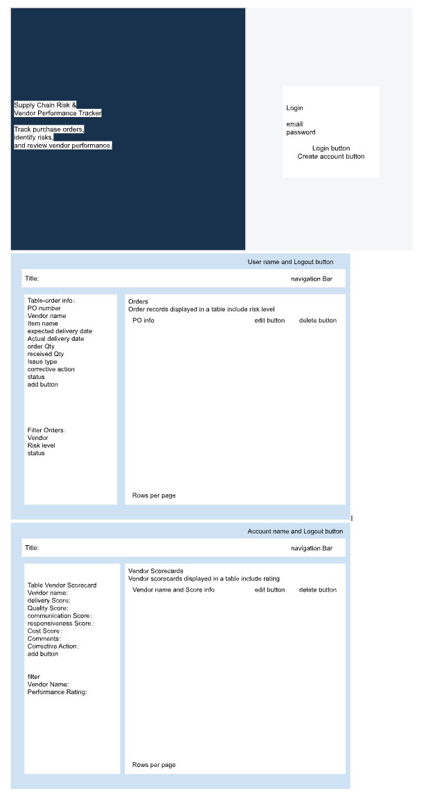

#Supply Chain Risk and Vendor Performance Tracker
##Author
Han Huang

##Project Description
The Supply Chain Risk and Vendor Performance Tracker is a full-stack web application for recording purchase order information, tracking supply chain risks, and reviewing vendor performance.
Users can record order information and track late deliveries, quantity shortages, quality issues, corrective actions, and unresolved order problems. They can also create vendor scorecards using delivery, quality, communication, responsiveness, and cost scores.

##User Personas
###Cindy — Supply Chain Planner
Cindy manages purchase orders from different vendors and for different products. She can’t monitor many orders at the same time, so she needs one place to review expected and actual delivery dates, received quantities, shortages, quality issues, corrective actions, and issue status.
###Hedy — Sourcing Manager
Hedy reviews supplier performance. She wants to use delivery, quality, communication, responsiveness, and cost to compare suppliers and identify which vendors may need improvement.

##User Stories
###Order Risk Tracking 
As a supply chain planner, I want to record, review, update, delete, and filter purchase order information. That will help me understand what happened and identify unresolved risks quickly.
###Vendor Performance Scorecard
As a sourcing manager, I want to create, review, update, delete, and filter vendor scorecards so that I can evaluate supplier performance and identify vendors that may need corrective action.

##Authentication
I want to log in so I can view the application's order and vendor performance records

##Application Pages
###Login and Registration
Users can create an account, log in, stay logged in through a session, and log out.

###Orders
Users can:
Record purchase order information
Update and delete order records
Filter orders by vendor, risk level, and status
Review automatically calculated risk levels
View paginated order records

###Vendor Scorecards
Users can:
Create vendor scorecards
Update and delete scorecards
Enter delivery, quality, communication, responsiveness, and cost scores
Review automatically calculated overall scores and performance ratings
View paginated scorecard records

##Technology Stack
React with Hooks
Node.js
Express
MongoDB Node.js Driver
Passport Local Authentication
HTML
CSS
Fetch API

### Login and Registration Page,Orders Page,Vendor Scorecards Page

